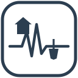

# Aardbevingen NL - epicentrum & rijksmonumenten

Interactieve kaart van Nederlandse aardbevingen met een straal-selectie die laat zien welke
rijksmonumenten binnen die straal liggen, inclusief een verkennende impactindicatie per monument -
geen schadebeoordeling.

**Live demo:** https://jolietjakeblues.github.io/aardbevingen-en-rijksmonumenten/

Huidige versie: 0.20.4 - zie [CHANGELOG.md](CHANGELOG.md) voor de volledige versiegeschiedenis.

Standalone HTML/CSS/JS, geen build-stap, geen servercode, geen API-key nodig.

## Wat doet de kaart

Je selecteert een aardbeving (klik op de kaart, of zoek op plaatsnaam) en een straal in
kilometers. De kaart laat vervolgens zien welke rijksmonumenten binnen die straal liggen, met per
monument een impactindicatie die aangeeft hoe plausibel het is dat de beving daar voelbaar was. Achtergrond over waarom deze combinatie van data relevant is, staat op de aparte
pagina [`docs/achtergrond.html`](docs/achtergrond.html) (bereikbaar via de link onderaan de
kaart).

## Belangrijkste functies

- Epicentrum selecteren via de kaart of via een plaatsnaam-zoekveld met autocomplete.
- Straal-slider (1-200 km) met automatisch in-/uitzoomen op het geselecteerde gebied.
- Rijksmonument-popups met naam (indien bekend), oorspronkelijke én huidige functie, monumentaard,
  link naar het monumentenregister en de linked-data URI.
- Eigen icoon per monumenttype (huisje voor onroerend gebouwd, schop voor archeologisch) en een
  rood/oranje/groen weergave van de impactindicatie, onafhankelijk van elkaar te combineren.
- Tijd-animatie met een dubbele slider om een specifiek jarenvenster te kiezen of de opbouw van
  Groningse seismiciteit chronologisch af te spelen.
- Zoeken op rijksmonumentnummer: toont de locatie van dat monument en de dichtstbijzijnde
  aardbeving uit de volledige dataset, met een optie om die als epicentrum te selecteren.
- Niet-geselecteerde aardbevingen faden zodra er een epicentrum actief is, om drukke clusters
  (Groningen, Limburg) rustig te houden.
- Download CSV: exporteert de huidige straal-resultaten (aardbeving + alle getoonde
  rijksmonumenten, beide typen) als platte, pipe-gescheiden CSV.
- Filter op monumentaard/oorspronkelijke functie: klikbare labels met aantallen (bv. "Boerderij
  (56)") filteren de kaart en de CSV-export tot alleen die categorie, volledig client-side.
- Toegankelijkheid: verborgen labels, `aria-live`-statusmeldingen, toetsenbordbedienbare legenda.
- Robuuste dataverzoeken: timeouts en gedeeltelijke resultaten bij het uitvallen van één bron, in
  plaats van dat de hele pagina faalt.

Volledige featurelijst en changelog per versie: zie [CHANGELOG.md](CHANGELOG.md).

## Databronnen

De aardbevings- en monumentgegevens worden tijdens het gebruik rechtstreeks bij de bron
opgehaald. De applicatie bevat geen ingebouwde momentopname van deze datasets.

- **Aardbevingen:** KNMI, rechtstreeks via `rdsa.knmi.nl` (CSV).
- **Rijksmonumenten:** RCE Cultureel Erfgoed Linked Open Data, via het CHO SPARQL-endpoint (CEO-ontologie).

Waarom rechtstreeks het KNMI, welke bronnen zijn afgewogen, en hoe de rijksmonumenten-query werkt:
zie [documentation/DATA.md](documentation/DATA.md).

## Beperkingen en disclaimer

De impactindicatie is **verkennend - geen schade- of risicobeoordeling**. Formule, kalibratie op
drie gepubliceerde IMG-effectgebieden en de belangrijkste beperking (niet gevalideerd voor
diepe/tektonische bevingen) staan in [documentation/IMPACTSCORE.md](documentation/IMPACTSCORE.md).

Overige bekende beperkingen, query-limieten, afhankelijkheid van externe
diensten en de roadmap staan in [documentation/DEVELOPMENT.md](documentation/DEVELOPMENT.md).

## Lokaal draaien

Geen build-stap nodig. Twee opties:

1. Dubbelklik `docs/index.html` (werkt in de meeste browsers, `fetch()` naar externe https-bronnen
   is niet CORS-geblokkeerd vanaf een `file://`-pagina).
2. Of serveer de map lokaal voor de beste compatibiliteit:
   ```bash
   python -m http.server 8000
   ```
   en open `http://localhost:8000/docs/index.html`.

Handmatige testchecklist na een wijziging: zie [documentation/TESTS.md](documentation/TESTS.md).

## Disclaimer

Deze toepassing is een onafhankelijk initiatief en is niet gebouwd in opdracht van het KNMI of de Rijksdienst voor het Cultureel Erfgoed. De kaart gebruikt openbare gegevens die rechtstreeks bij deze organisaties worden opgehaald. De weergave en berekeningen zijn informatief en verkennend. Aan de inhoud kunnen geen rechten of plichten worden ontleend.

Lees de volledige disclaimer in [DISCLAIMER.md](DISCLAIMER.md).

## Licentie

[MIT](LICENSE) - vrij te gebruiken, aan te passen en te verspreiden, mits de copyright-notice
behouden blijft. Let op: dit dekt alleen de code in deze repository. De gebruikte databronnen
(RCE linked open data) zijn overheidsdata met hun eigen voorwaarden; check die van RCE en
IMG/schadedoormijnbouw.nl voordat je afgeleide claims publiceert.

## Dank aan

- Het KNMI voor de openbare aardbevingsgegevens.
- De Rijksdienst voor het Cultureel Erfgoed voor de linked data over rijksmonumenten en de
  Cultureel Erfgoed Ontologie.
- Het Instituut Mijnbouwschade Groningen voor de gepubliceerde gegevens over effectgebieden.
- Leaflet en CARTO voor de kaartweergave.
